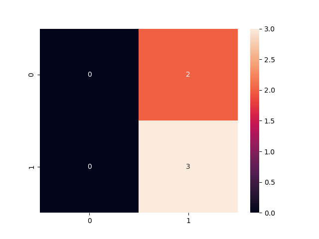

# Project: A Dynamic Risk Assessment System
The company requires you to develop, deploy, and continuously monitor an ML-based risk assessment model to estimate attrition risk for each of its 10,000 clients. A successful model will empower client managers to proactively engage with high-risk clients, preventing potential revenue losses.

However, your responsibilities don't end with model deployment. Your industry is dynamic, subject to constant change, and a model created even just a month ago may become obsolete. Hence, you must establish ongoing processes and scripts for model retraining, redeployment, monitoring, and reporting. This ensures that the company receives accurate and up-to-date risk assessments, minimizing client attrition and maximizing revenue retention

source code: [https://github.com/ndtands/mldevops_A_Dynamic_Risk_Assessment_System.git](https://github.com/ndtands/mldevops_A_Dynamic_Risk_Assessment_System.git)


## The Workspace
```
/home/workspace, the root directory. When you load your workspace, this is the location that will automatically load. This is also the location of many of your starter files.
/practicedata/. This is a directory that contains some data you can use for practice.
/sourcedata/. This is a directory that contains data that you'll load to train your models.
/ingesteddata/. This is a directory that will contain the compiled datasets after your ingestion script.
/testdata/. This directory contains data you can use for testing your models.
/models/. This is a directory that will contain ML models that you create for production.
/practicemodels/. This is a directory that will contain ML models that you create as practice.
/production_deployment/. This is a directory that will contain your final, deployed models.
```

## Setup
```
pip install -r requirements.txt
```

## GUIDE DETAIL
### 1. Data Ingestion
- Writing the dataset
- Recording ingested files
```
python ingestion.py

2023-11-09 16:53:12,104 - root - INFO - Files in the input folder: [PosixPath('practicedata/dataset1.csv'), PosixPath('practicedata/dataset2.csv')]
2023-11-09 16:53:12,108 - root - INFO - Merged dataframe shape: (26, 5)
```

### 2. Training, Scoring and Deploying and ML Model
There are three Python template files that you should use for this step. All are in your collection of starter files:
- **training.py**, a Python script that will accomplish model training
- **scoring.py**, a Python script that will accomplish model scoring
- **deployment.py**, a Python script that will accomplish model deployment

```
python training.py

2023-11-09 16:59:52,222 - __main__ - INFO - Training model....
2023-11-09 16:59:52,228 - __main__ - INFO - Model saved at /home/tari/Documents/Udacity/starter-file/practicemodels/trainedmodel.pkl
2023-11-09 16:59:52,228 - __main__ - INFO - Training model finished
```
```
python scoring.py

2023-11-09 17:03:17,153 - __main__ - INFO - Scoring model....
2023-11-09 17:03:17,160 - __main__ - INFO - F1 score: 0.5714285714285715
```
```
python deployment.py

2023-11-09 17:06:45,913 - __main__ - INFO - All files saved at /home/tari/Documents/Udacity/starter-file/production_deployment
```

### 3. Diagnostics
Model and data diagnostics are important because they will help you find problems - if any exist - in your model and data. Finding and understanding any problems that might exist will help you resolve the problems quickly and make sure that your model performs as well as possible.

```
python diagnostics.py

....
2023-11-09 17:17:48,259 - training - INFO - Model saved at /home/tari/Documents/Udacity/starter-file/production_deployment/trainedmodel.pkl
2023-11-09 17:17:48,259 - training - INFO - Training model finished
2023-11-09 17:17:48,259 - training - INFO - Training model....
2023-11-09 17:17:48,264 - training - INFO - Model saved at /home/tari/Documents/Udacity/starter-file/production_deployment/trainedmodel.pkl
2023-11-09 17:17:48,264 - training - INFO - Training model finished
2023-11-09 17:17:48,264 - __main__ - INFO - Training time: 0.006520473700038565
2023-11-09 17:18:52,998 - __main__ - INFO - Outdated packages: [['click', '7.1.2', '8.1.7'], ['cycler', '0.10.0', '0.11.0'], ['Flask', '1.1.2', '2.2.2'], ['gunicorn', '20.0.4', '21.2.0'], ['itsdangerous', '1.1.0', '2.0.1'], ['Jinja2', '2.11.3', '3.1.2'], ['joblib', '1.0.1', '1.1.1'], ['kiwisolver', '1.3.1', '1.4.4'], ['MarkupSafe', '1.1.1', '2.1.1'], ['matplotlib', '3.3.4', '3.7.2'], ['numpy', '1.20.1', '1.24.3'], ['pandas', '1.2.2', '2.0.3'], ['Pillow', '8.1.0', '10.0.1'], ['pyparsing', '2.4.7', '3.0.9'], ['python-dateutil', '2.8.1', '2.8.2'], ['pytz', '2021.1', '2023.3.post1'], ['scikit-learn', '0.24.1', '1.3.0'], ['scipy', '1.6.1', '1.11.3'], ['seaborn', '0.11.1', '0.12.2'], ['six', '1.15.0', '1.16.0'], ['threadpoolctl', '2.1.0', '2.2.0'], ['Werkzeug', '1.0.1', '2.2.3']]
```

### 4. Reporting
Model reporting is important because reporting allows us as data scientists to be aware of all aspects of our data, our model, and our training processes, as well as their performance. Also, automated reporting enables us to keep stakeholders and leaders quickly and reliably informed about our ML efforts.

```
python reporting.py

2023-11-09 17:22:43,159 - __main__ - INFO - Confusion matrix: [[0 2]
 [1 2]]
2023-11-09 17:22:43,333 - __main__ - INFO - Confusion matrix saved to /home/tari/Documents/Udacity/starter-file/practicemodels/confusionmatrix.png
```


### 5. API run and test
Create an API with four endpoints for convenient access to machine learning diagnostics and results: one for model predictions, one for model scoring, one for summary statistics, and one for other diagnostic information.

```
python app.py
python apicalls.py

```

### 6. Full Process
Make cronjob to run full process every 10 minutes
```
python fullprocess.py

2023-11-09 18:19:28,559 - __main__ - INFO - There is new files. Ingesting new files...
2023-11-09 18:19:28,559 - root - INFO - Files in the input folder: [PosixPath('sourcedata/dataset3.csv'), PosixPath('sourcedata/dataset4.csv')]
2023-11-09 18:19:28,562 - root - INFO - Merged dataframe shape: (26, 5)
2023-11-09 18:19:28,564 - scoring - INFO - Scoring model....
2023-11-09 18:19:28,568 - scoring - INFO - F1 score: 0.6896551724137931
2023-11-09 18:19:28,568 - __main__ - INFO - Model drift >> Previous F1_score 0.7692307692307693 != New F1_score 0.6896551724137931
2023-11-09 18:19:28,568 - __main__ - INFO - Re-training...
2023-11-09 18:19:28,568 - training - INFO - Training model....
2023-11-09 18:19:28,573 - training - INFO - Model saved at /home/tari/Documents/Udacity/starter-file/models/trainedmodel.pkl
2023-11-09 18:19:28,573 - training - INFO - Training model finished
2023-11-09 18:19:28,573 - __main__ - INFO - Re-deploying
2023-11-09 18:19:28,574 - deployment - INFO - All files saved at /home/tari/Documents/Udacity/starter-file/production_deployment
.....
```
Make cronjob to run full process every 20 mintues
```
crontab -e */20 * * * * /home/tari/Documents/Udacity/starter-file/fullprocess.py
```




## Code Quality
Style Guide - Format your refactored code using PEP 8 – Style Guide. Running the command below can assist with formatting. To assist with meeting pep 8 guidelines, use autopep8 via the command line commands below:
```bash
autopep8 --in-place --aggressive --aggressive .
```

Style Checking and Error Spotting - Use Pylint for the code analysis looking for programming errors, and scope for further refactoring. You should check the pylint score using the command below.
```bash
pylint -rn -sn .
```
Docstring - All functions and files should have document strings that correctly identifies the inputs, outputs, and purpose of the function. All files have a document string that identifies the purpose of the file, the author, and the date the file was created.
